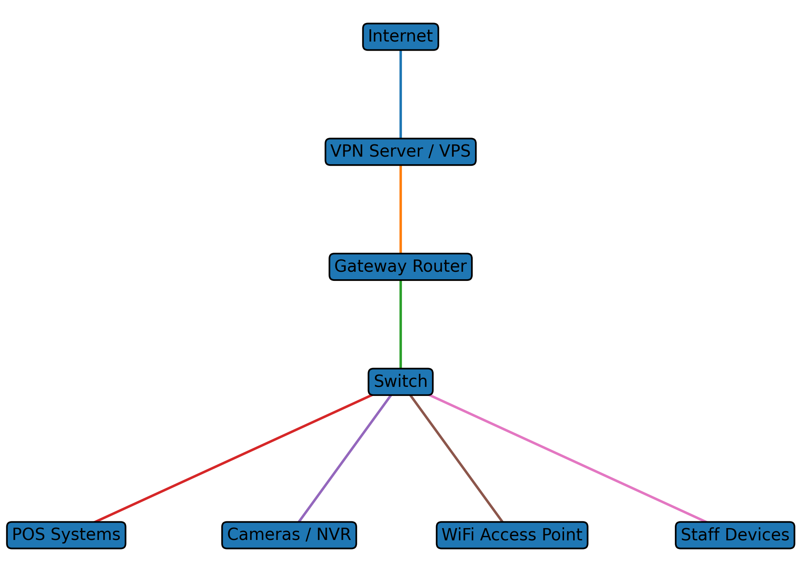

# Hospitality Network Security Uplift
Security Assessment & Remediation Case Study

This repository documents a **real-world network security remediation project** performed for a small hospitality venue.

The objective was to assess the security posture of an existing network, identify vulnerabilities, and implement practical improvements to reduce risk while maintaining business operations.

All identifying details, credentials, and internal network information have been removed to protect the organisation.

## Repository Contents

| Section | Description |
|--------|-------------|
| [Initial Assessment](report/initial-assessment-summary.md) | Summary of vulnerabilities identified during the initial audit |
| [Threat Model](report/threat-model.md) | STRIDE threat modelling of the network environment |
| [Remediation Notes](remediation-notes/) | Security improvements implemented |
| [Network Diagram](diagrams/sanitized_network_diagram.png) | Sanitised architecture diagram |

---

# Project Overview

The initial assessment identified several common small-business security issues that could lead to network compromise if left unaddressed.

## Security Risk Summary

| Severity | Issues Identified                            |
| -------- | -------------------------------------------- |
| Critical | Default administrative credentials           |
| High     | Insecure remote administration configuration |
| High     | Outdated network device firmware             |
| Medium   | Weak wireless security configuration         |
| Medium   | Lack of network documentation                |

**Overall Risk Rating:** High

Risk was primarily driven by exposed administrative services and default credentials on critical infrastructure devices.

## Security Assessment Methodology

The following methodology was used during the assessment:

1. **Network Enumeration**
   - Identification of network infrastructure and services

2. **Configuration Review**
   - Analysis of administrative access methods and device settings

3. **Vulnerability Identification**
   - Detection of misconfigurations and outdated firmware

4. **Threat Modelling**
   - STRIDE analysis used to evaluate potential attacker pathways

5. **Remediation Planning**
   - Prioritisation of security improvements based on risk level

6. **Implementation & Hardening**
   - Deployment of configuration changes to secure the environment

## Techniques & Concepts Used

- STRIDE Threat Modelling
- Attack Tree Analysis
- Network Enumeration
- Infrastructure Hardening
- VPN Security Architecture

### Key Findings

* Default credentials on critical infrastructure
* Outdated firmware on network devices
* Insecure remote access configuration
* Weak wireless security configuration
* Lack of network documentation and device inventory
* Exposed administrative services

These weaknesses significantly increased the risk of **unauthorised access, credential compromise, and potential full network compromise**.
---

# Security Assessment & Analysis

This project includes several security analysis components typically used in professional security engagements:

* **Vulnerability assessment** of network services and infrastructure
* **Threat modeling** to evaluate realistic attacker pathways
* **Attack tree analysis** to map possible compromise scenarios
* **Remediation planning** to reduce risk and harden the environment

Repository contents:

```
hospitality-network-security-uplift/
│
├─ README.md
│
├─ report/
│   ├─ initial-assessment-summary.md
│   ├─ threat-model.md
│   └─ attack-tree.md
│
├─ remediation-notes/
│   └─ remediation-plan.md
│
└─ diagrams/
    └─ sanitized_network_diagram.png
```

---

# Remediation Work

The following improvements were implemented to reduce risk and improve overall security posture:

* Replacement of default administrative credentials
* Deployment of **VPN-based remote administration**
* Firmware updates across network infrastructure
* Wireless network reconfiguration using modern encryption standards
* Hardening of administrative services
* Creation of a device inventory and network documentation

---

# Results

Following remediation:

* Critical vulnerabilities were eliminated
* Administrative access pathways were secured
* Network infrastructure firmware was updated
* Device management services were hardened
* Overall network security posture was significantly improved

---

# Skills Demonstrated

This project demonstrates practical cybersecurity and infrastructure skills including:

* Network enumeration
* Network security auditing
* Vulnerability analysis
* Threat modeling
* Security architecture thinking
* Infrastructure hardening
* VPN deployment
* Wireless network configuration
* Security documentation

---

# Network Architecture (Sanitised)

A simplified network diagram is included to illustrate the architecture of the environment.

See:

```


```

---

# Disclaimer

This repository is a **sanitised case study based on a real project**.

All sensitive information including credentials, IP addresses, device identifiers, and business details has been removed.
